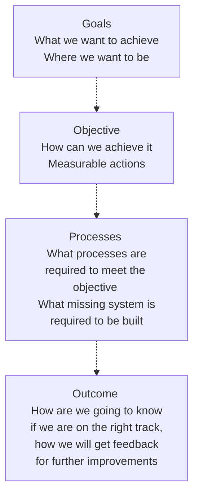
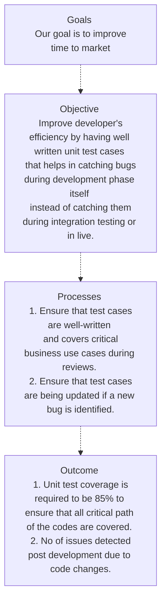
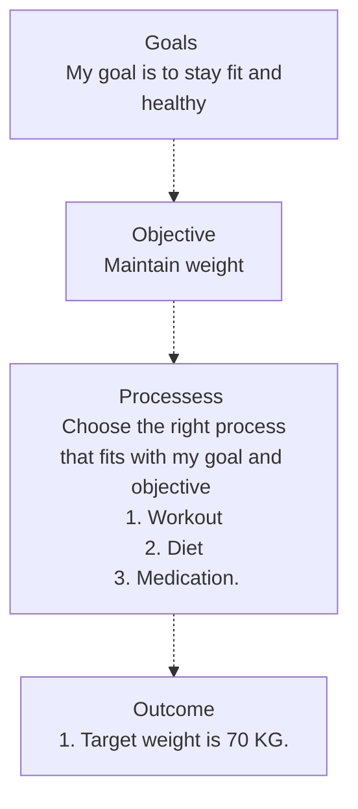
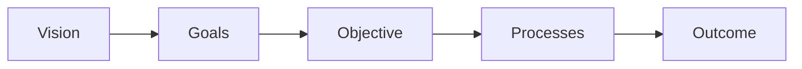

# Goals, Objective and Outcomes
## Background
In our day to day life, we are often asked various questions like "why we are doing this", "what would happen if we don't do it", "how do we know if we are doing the right thing" and so on.

The reason why these questions comes to our mind is because are we think inside out and we don't have the sufficient context why this decision was made and why we are being asked to do a specific task.

As an example, a team might get a goal that the unit test coverage for the components should be at least 85%. We all understand the need for having the unit test cases but then we have questions about the measurement criteria. E.g. is it important to have well written test cases vs some poorly written test cases that have 80-90% line coverage?

This is where we need to share a big picture with the team mates and we need to explain and share the *why* (goals and objectives) so that team better understanding and is able to help in achieveing the actual goal even though if it means that we have to adjust the measurement criteria from 85% coverage to 80% coverage and well maintained test cases.

> The maintainance of the test case is very important and we should add update them if we are founding any new bug.

## Template
The big picture can be shared using following template:

Note - Outcomes should be used for identifying the gaps and improvements - What changes are required in processes, What changes are required in objectives.

## Examples
### Example 1

### Example 2

There could be N number of processes that might lead to desired outcome so we need to pick the approaches that are aligned with objective.
We revisit the processes / system if goals and objective are not being fullfilled.

In above case, only "workout" process will help in achieving the desired goal. If its diet then it wouldn't help in achiving the overall goal.

### Reference

