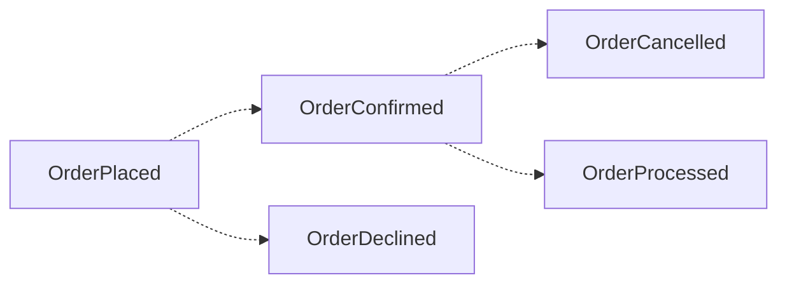
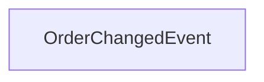
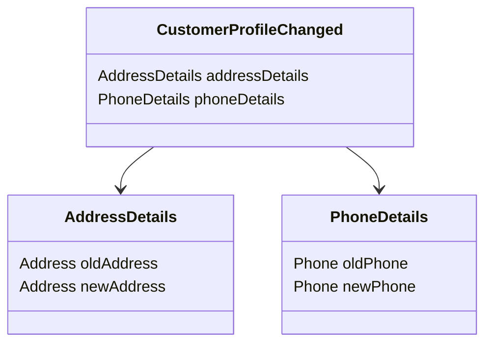
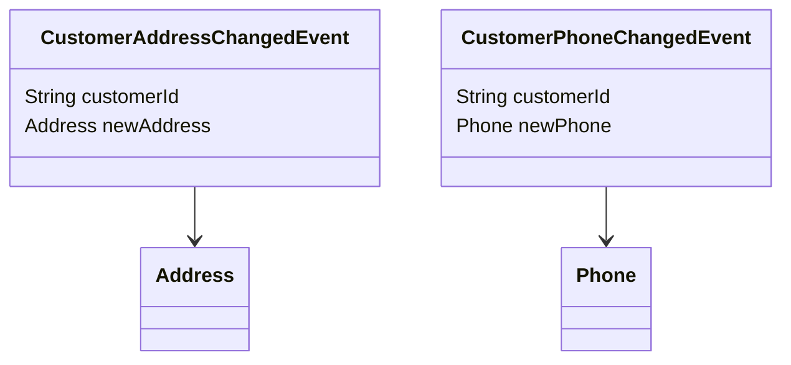
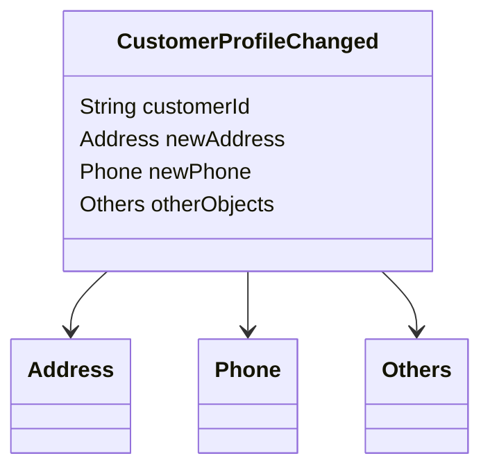
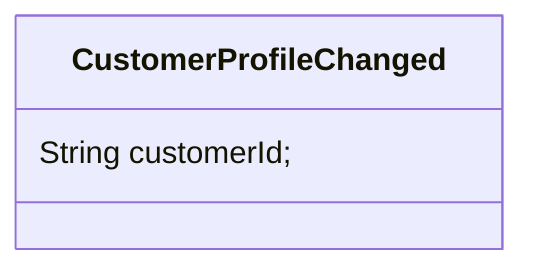

# Event Driven Architecture

How would you model event publishing if payload size is very huge?
https://akfpartners.com/growth-blog/claim-check-pattern

# Taxonomy
- Publisher - A service that publishes the events.
- Consumer - A client application that consumers the events.
- Event - An event signals the changes in the application state or resources or the domain aggregate.

# Event Modelling
## Domain Events
> A domain event is published whenever a business operation is performed by the customer of the system.

### General Purpose Change Event (a.k.a. Event Carried State Transfer)

### Delta Events
Delta Events contains the old value and the new value. This type of event is required when consumers are interested in knowing the old and updated value. A simple use case would to be for *Activlity Log Service* that keeps track of *what* actions were performed by the customer and *what values* were changed and on what date.

### Fine Grained Event
If there are many consumers and each consumer is interested in specific part of the message payload then fine grained events can be useful as consumers are decoupled and they are only aware of the payload details that are specific to thier business needs. 

The other use case for fine grained events could be the security and access role. In this case, publisher might want to be careful about the info that is shared with consumer as it might lead to security, data privacy and other access related issues.

The fine grained events can also help in improving the overall availablity of the system as it helps in reducing the blast radius of the impact in case if any part of the system that publishes these event is down (Tradeoff - entire event not being available vs part of the event not being available). It also helps in improving the performance of the consumer app as they wouldn't have to deal with noise (unwated events).

On the other side, this will lead to fan-out effect where multiple events will have to be published for a single business trasaction (e.g. customer updating the profile) and in case if a consumer is interseted in all the details of a business transaction then this pattern will add more work and complexities for the consumer.

In this example, if pubisher changes the contract of the Phone then there wouldn't be any impact to the consumers who are consuming the AddressChangedEvent.

### Coarse Grained Event
Coarse grained events contain all the details about the resource (domain aggregate). This can help in reducing the complexity on consumer side as they get all the details in one single payload and they wouldn't have to make additional calls for loading the missing part of the payload.

This also helps in reducing the divergence with the publisher system for the cases when the state of the resources changes frequently as the entire context of the changes is part of the payload and doesn't require any changes. E.g. The customer's balance will be diffrent in case if multiple transactions are procsssed within a short period of time. 

On the other side
- This model adds some level of complexity on the publisher side as its difficult for them to find out which consumers are interested in what part of the events and they have to align with all consumers whenever there are changes to the events.
- This model also adds additional load on consumer side as they end up processing more events then they should be processing.

The corase grained events can be really useful for audit trail, transaction history like use cases.

### Thin Event (a.k.a Event Notification)
This event contain the minimal payload for the resource changes (e.g. resource id, status). The main purpose is to inform the client then something has happened in the system and consumers are required to load the other details for subsequent processing.

Thin events are useful when consumers must process the the latest state of the events. In this case, consumer always load the latest state via API call instead of relying on the payload as it may not be up-to-date. This approach also helps in solving the out of order issue for the events.

On the contratry, the Fat event is similar to coarse grained events and contains the entire resource payload.

## References

[Event Notification vs Event Carried State Transfer](https://medium.com/swlh/event-notification-vs-event-carried-state-transfer-2e4fdf8f6662)

[Case Study - Document Processor System for Due Dillgience](https://www.infoq.com/articles/eda-mediator/)

/filters:no_upscale()/articles/eda-mediator/en/resources/27figure-1-1685547198564.jpg)
