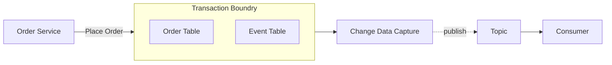

# Microservices - Articles!

The [microservice architectural style](https://martinfowler.com/articles/microservices.html) is an approach to developing an application as a suite of small independently deployable services built around specific business capabilities

## [IDEALS](https://www.infoq.com/articles/microservices-design-ideals/)
    Interface segregation
    Deployability (is on you)
    Event-driven
    Availability over consistency
    Loose coupling
    Single responsibility
## Saga Pattern
- Orchestration
- Choreography 

## [Transaction Outbox Pattern](https://microservices.io/patterns/data/transactional-outbox.html) - 
- A service must atomically update the database and send messages in order to avoid data inconsistencies and bugs. 

## [Conway's Law](https://martinfowler.com/bliki/ConwaysLaw.html)

- [The two-pizza team rule](https://docs.aws.amazon.com/whitepapers/latest/introduction-devops-aws/two-pizza-teams.html)

- Domain Driven Design
    - A microservice shouldn't be bigger than bounded context and shouldn't be smaller than the aggregate.

## Anti Patterns
- Microservice for C.R.U.D operations.
    - A microservice should be designed to perform business operations. Use Data Access Layer for C.R.U.D operations and you may not need a micro-service for it.

## References
[Martin fowler - Microservices Prequisite - You must be this tall](https://martinfowler.com/bliki/MicroservicePrerequisites.html)

[Twelve factor App for micro services](https://12factor.net/)

[Services by Lifecycle](https://www.michaelnygard.com/blog/2018/01/services-by-lifecycle/)

[Microservices Patterns](https://dzone.com/articles/design-patterns-for-microservices-1)

#### Microservices Data

[The Harderst part about microservices data](https://blog.christianposta.com/microservices/the-hardest-part-about-microservices-data/)

#### Miscorservices migration strategy

[Marin Folwer - Strangler Pattern](https://martinfowler.com/bliki/StranglerFigApplication.html)

[Steve Smith - Verify Branch By Abstraction](https://www.stevesmith.tech/blog/application-pattern-verify-branch-by-abstraction/)

## Webinars
<iframe allow="autoplay *; encrypted-media *; fullscreen *; clipboard-write" frameborder="0" height="175" sandbox="allow-forms allow-popups allow-same-origin allow-scripts allow-storage-access-by-user-activation allow-top-navigation-by-user-activation" src="https://embed.podcasts.apple.com/il/podcast/engineering-stack-overflow-with-roberta-arcoverde/id117488860?i=1000568359491"></iframe>