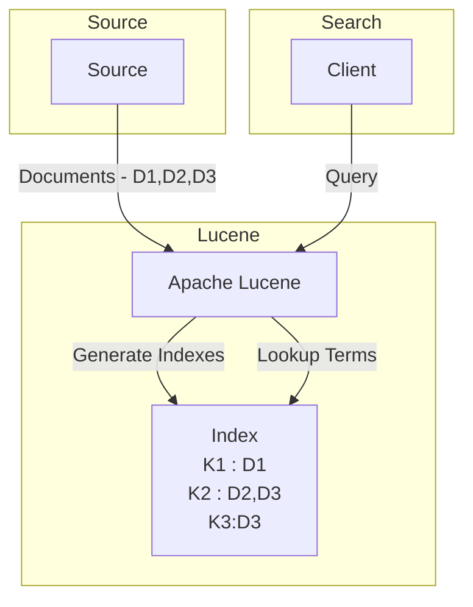
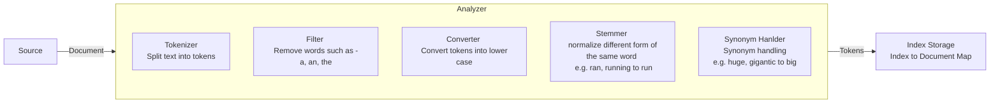
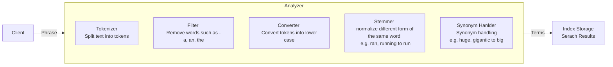
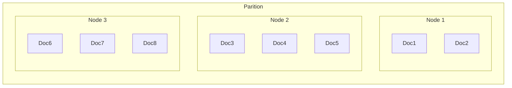
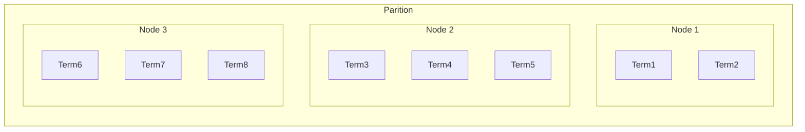

# Apache Lucene
Apache lucune provides the key capabilities for indexing and searching. It is used by ElasticSearch and [Apache Solr](https://solr.apache.org/)

## Taxonomy
**Document** - Document contains the info that is required be indexed and searched. E.g. A web page, a tweet etc.

**Query** - Query is the search phrase.

**Term** - A query consists of terms (tokens) that are used for search. [the unit of search]

**Inverted index** - Inverted index is a data structure that maps terms to the documents.

## High Level Overview

Lucene provides two core capabilities:

** Indexing ** - The documents that are required to be searched are ingested into the lucene for creating the inverted indexes.

** Searching ** - The query provided by the client is tokenized into terms and then lucne uses these terms for the look up using the inverted indexes. Lucene can also keep track of the term frequency etc for giving relevant results.

## Low Level Overview

Lucene has multiple low level module that helps in performign the indexing and serach operations.

## Other Features
- Support for different Searching methods (Ranking, Sorting etc.)
    - Term frequency in document
    - Number of terms in the query that were found in the document
    - etc.
- Supports differnt Query types: phrase queries, wildcard queries etc.
- Multiple-index searching with merged results
- Support for simultaneous update and searching

## Distributed Index
- Document Based Parition - In this model, documents will be distributed to the nodes as part paritioning logic. In indexing phase, this node will do the local indexing of the document and keep the result of the inverted indexes. In search phase, all the nodes will be sent query for the result that will be 
merged later on.

- Term Based Parition

The parition could be based on hash values or key range (e.g. T1 to Tn goes to Node 1)

## References:

[Lucene](https://lucene.apache.org/core/)

[Blog](https://j.blaszyk.me/tech-blog/exploring-apache-lucene-index/)

[Elastic Search - Architecture](https://medium.com/geekculture/elasticsearch-architecture-1f40b93da719)

[Blog](https://levelup.gitconnected.com/lucene-search-engine-in-action-32146d5dab09)

