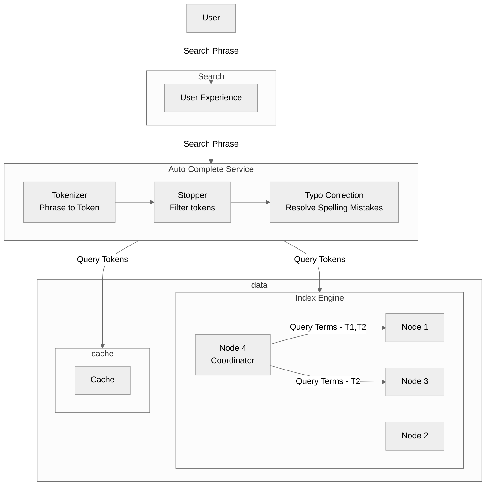
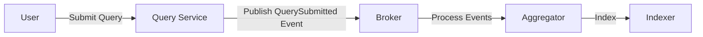

# Auto compeltion for Search

## Auto completion flow
### Functional Requirements
Please refer below diagram for the requirements overview:

Questions:
- How many characters should we let user type in before starting the auto-completion process
- How many times should we do auto completion e.g. 1st auto-completion after 3 words then after new word?
- 

### Non Functional Requirements
- Low Latency (less than 50 ms)
- Highly Available (99.99%)
- Number of concurrent users (~ 10 millions)
- Geography (single region)

### High Level Flow

Elastic Search could be one implementation of the auto completion service.

Notes : 
- The engine follows the scatter/gather pattern
- The coordinator will have to lookup for the nodes (shards) from the local copy of the shard mapper for identifiying the nodes that are required to be queries. 
- The shard mapper will be managed by the quorum.

[Elastic Search](https://www.elastic.co/blog/found-elasticsearch-top-down)

[Quickwit Architecture](https://quickwit.io/docs/main-branch/overview/architecture)

### Questions
- How will you give top phrases (top 5)?
- How will you handle trends (e.g. political event, major accident, celebrity news)?
- How will you keep latency low?
- How will you manage unique phrases for auto completion (e.g. 60% of the customers are typing the same phrase for auto completion)?

## Query Indexing Flow

Customer submitted queries will be used for identifying the top candidates for auto completion flow.

