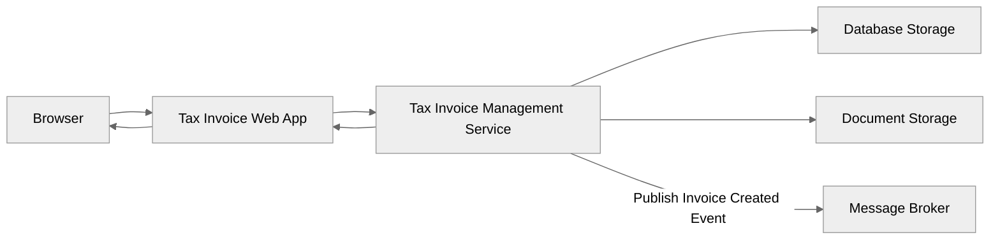
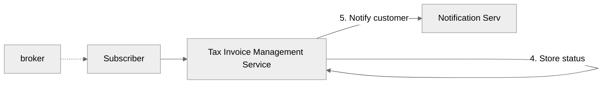
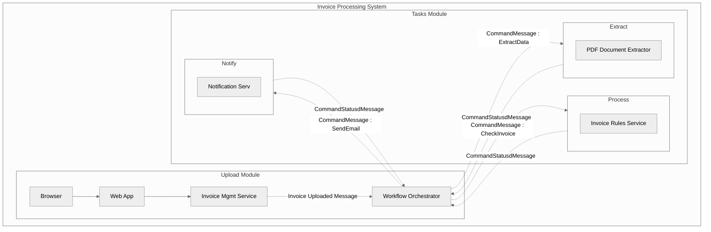

# Tax Invoice Processing System

Design a system that businesses are able to use for checking tax invoices :
1. Businesses upload the tax invoices for checking if they are any tax filing related issues (tax compliance check). The backend will have to parse the invoice pdf, run the checks (tax related rules) and then store the result.
- The number of invoices could be upto 10,000
- The invoice could be ~5 MB size.
2. View the history of invoice statuses for upto a year.

# 1. Monolith approach
In this approach, there will be a single backend service that will be responsible for all the business logic. There will be two main flows - 1. To accept the invoice file request and storage them in the file server for further processing. 2. The actual processing of the invioce files.

### Upload the invocies for the processing.
1. Customer uploads the invoices as pdfs.
2. The invoices pdfs are stored in file storage and invoice entries are created with pending status in the database.
3. Response is returned back to the customer.

### Process the invocies and store thier results.
1. Invoice processing requires extraction of the raw data from the pdf.
2. The raw data is used for evaluating the rules.
3. Raw data along with status is stored in the database.
4. Customer is notified of the outcome.

# 2. Batch based approach
Upload files to common shared location and do batch processing - Its similar to above approach but here the files will be exchanged via central server. This pattern is more suitable for server-to-server intraction but if customer experience is involved then it will be good to consider other options so that we are able to notify the customers in near-real-time.

If it is server-to-server intraction then we will have to think about following decisions:
1. Roles and Responsbilitities of the batch

The role of the batch could be just to ingest the files into the system and delegate rest of the of functionalities to the other modules. As an example, the batch can pick up the files from the source and then store it into the file server and then delegate the responsiblity of processing the file to another component. The main advantage of this approach is that any changes to the processing logic wouldn't have any impact to the batch schedules because releasing the change would require re-deployment of the batch component.

On the other hand, the batch could also act like a orchestrator where it can call various microservices e.g. data extraction service, invoice check service etc and maintain the processing status however the volume of number of invoice files should be considered for the design decision. If intake rate is very high then it can cause performance issues and slow down the entire pipeline.

2. Resiliency and fault tolerance

As the batch application will have to load the files for procesinng, there could be intermittent failures or re-start that maybe required from time to time so it is important to keep track of the batch files status seperately so that if at any point in time there is any issue the batch is able to resume the processing.

# 3 . Orcehstrator

In this approach, we can use the SAGA pattern (choreography) for the processing of the invoice files.

[Ref - Document Processor System for Due Dillgience](https://www.infoq.com/articles/eda-mediator/)

The diagrams in this articles are created using [mermaid](https://mermaid.js.org/syntax/flowchart.html)