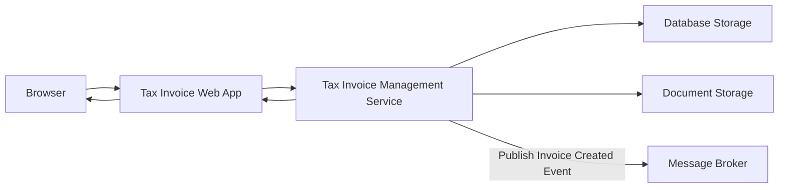
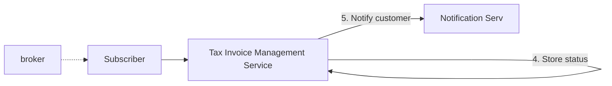

# Tax Invoice Processing System

Design a system that businesses are able to use for checking tax invoices :
1. Businesses upload the tax invoices for checking if they are any tax filing related issues (tax compliance check). The backend will have to parse the invoice pdf, run the checks (tax related rules) and then store the result.
- The number of invoices could be upto 10,000
- The invoice could be ~5 MB size.
2. View the history of invoice statuses for upto a year.

# 1. Events based approach
Upload invoices and then publish the event for processing the invoice - As there could be 10,000 files, it wouldn't be practical to do the processing in real time so its better to first upload the files to the file server and then do async processing. Customer can be notified via emails etc about the results.

### Upload the invocies for the processing.
1. Customer uploads the invoices as pdfs.
2. The invoices pdfs are stored in file storage and invoice entries are created with pending status in the database.
3. Response is returned back to the customer.

### Process the invocies and store thier results.
1. Invoice processing requires extraction of the raw data from the pdf.
2. The raw data is used for evaluating the rules.
3. Raw data along with status is stored in the database.
4. Customer is notified of the outcome.

# 2. Batch based approach
Upload files to common shared location and do batch processing - Its similar to above approach but here the files will be exchanged via central server.

The diagrams in this articles are created using [mermaid](https://mermaid.js.org/syntax/flowchart.html)